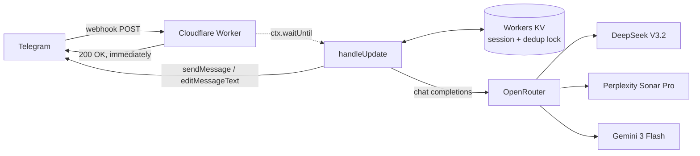

# Telegram AI Bot on Cloudflare Workers

A personal multi-model AI assistant on Telegram, running entirely on a Cloudflare Worker.
No server, no container, no always-on process — the whole bot is one Worker plus a KV
namespace, and it costs nothing to keep running.

Conversation state, model selection, and vision input are handled inside the Worker's
request lifetime; models are reached through [OpenRouter](https://openrouter.ai), so
switching between DeepSeek, Perplexity Sonar and Gemini is a string change rather than a
new SDK.

---

## Architecture



**Why the request returns before the work is done.** Telegram treats a slow webhook as a
failure and redelivers the same update. An LLM call takes far longer than Telegram is
willing to wait, so the Worker acknowledges the update immediately and continues the
actual work in `ctx.waitUntil()`. The reply arrives as a separate outbound API call.

**Why there is a dedup lock.** Not a precaution — the bot really did answer the same
message twice. An already-acknowledged update can still come back (a lost response, a
deploy mid-flight, Telegram's own retry), and because the work was handed off to
`ctx.waitUntil()` the moment the ack was sent, the second copy sails straight past that ack
and runs the whole model call again: two identical replies in the chat, two OpenRouter
charges. Every update now writes `processed:<chat>:<message>` into KV with a 300 s TTL
before any work starts, and a duplicate delivery finds the key and exits.

**Why replies are edited, not appended.** OpenRouter's response is not streamed to
Telegram, so the bot first posts a placeholder (`⏳ [model] thinking...`), then replaces it
via `editMessageText` once the answer is ready. One message in the chat, visible progress.

**Why every send retries without Markdown.** Telegram parses `parse_mode: "Markdown"`
strictly and returns 400 on anything malformed — an unmatched `*`, an underscore inside an
identifier, a stray backtick. Model output does that constantly, and the failure mode was
the expensive one: the answer had already been generated and paid for, but the edit was
rejected, so the chat sat on the placeholder forever and the reply was simply lost.
`sendMessage` and `editMessageText` both check `ok` now and resend the same text with no
`parse_mode` — the send path matters too, because a placeholder that never posts takes its
`message_id` with it and there is nothing left to edit. The system prompts already ask the
model to avoid Markdown; that alone did not hold, which is why the fallback exists.

---

## Features

| | |
|---|---|
| **Multi-model routing** | DeepSeek V3.2 by default, Perplexity Sonar Pro for web-grounded answers, Gemini 3 Flash for vision and harder reasoning |
| **Vision fallback** | Send an image while a text-only model is active and the request is transparently rerouted to a vision model for that turn |
| **Session memory** | Per-chat history in KV, capped at 12 messages, auto-reset after 10 minutes idle |
| **Retry** | `/retry` re-runs the last turn — re-downloading the original image if the turn had one |
| **Prompt profiles** | A search-mode system prompt with a fixed report structure, and an assistant prompt that adapts between technical and casual registers |
| **Markdown fallback** | Telegram rejects malformed Markdown with a 400; the send and edit paths both retry as plain text instead of losing the reply |
| **Access control** | Chat-ID whitelist — the bot ignores anyone not on it |

## Commands

| Command | Effect |
|---|---|
| `/s`, `/search` | Switch to Perplexity Sonar Pro (web search), clears history |
| `/pro`, `/g` | Switch to Gemini 3 Flash, clears history |
| `/basic` | Switch back to DeepSeek V3.2, keeps history |
| `/reset` | Back to default model, clears history |
| `/retry` | Re-run the last exchange |

Any other text, or a photo with an optional caption, is treated as a message to the model.

---

## Deploy

Requires a Cloudflare account, a Telegram bot token from
[@BotFather](https://t.me/BotFather), and an OpenRouter API key.

```bash
npm install -g wrangler
wrangler login

# 1. Create the KV namespace and put the returned id into wrangler.toml
wrangler kv namespace create TG_DB

# 2. Set the secrets (never commit these)
wrangler secret put TELEGRAM_AVAILABLE_TOKENS    # bot token from BotFather
wrangler secret put OPENAI_API_KEY               # OpenRouter API key
wrangler secret put CHAT_WHITE_LIST              # comma-separated chat IDs
wrangler secret put WEBHOOK_REGISTRATION_SECRET  # any random string you choose

# 3. Deploy
wrangler deploy
```

Then point Telegram at the Worker once. The secret travels in a header rather than the
query string, so it stays out of shell history and access logs — and it is a secret of its
own, not the bot token:

```bash
curl -H "X-Setup-Token: <your WEBHOOK_REGISTRATION_SECRET>" \
  https://<your-worker>.workers.dev/registerWebhook
```

The endpoint reports what Telegram actually said, so a 502 here means `setWebhook` was
rejected — not that the Worker is broken. Send the bot a message to confirm. `/reset` gives
you a clean session.

### Configuration

| Binding | Type | Purpose |
|---|---|---|
| `TG_DB` | KV namespace | Session history and dedup locks |
| `TELEGRAM_AVAILABLE_TOKENS` | secret | Telegram bot token |
| `OPENAI_API_KEY` | secret | OpenRouter API key |
| `CHAT_WHITE_LIST` | secret | Comma-separated Telegram chat IDs allowed to use the bot |
| `WEBHOOK_REGISTRATION_SECRET` | secret | Authorizes `/registerWebhook`. Deliberately not the bot token: if it is unset the endpoint returns 500 rather than falling back |

> **`CHAT_WHITE_LIST` is required.** If it is unset or empty the bot answers nobody. This
> is deliberate: the Worker URL is public and every reply spends OpenRouter credit, so the
> bot fails closed rather than open. Send yourself a message and read the chat ID from the
> Worker logs (`wrangler tail`) to find your own ID.

---

## Stack

Cloudflare Workers · Workers KV · Telegram Bot API · OpenRouter

## License

MIT
